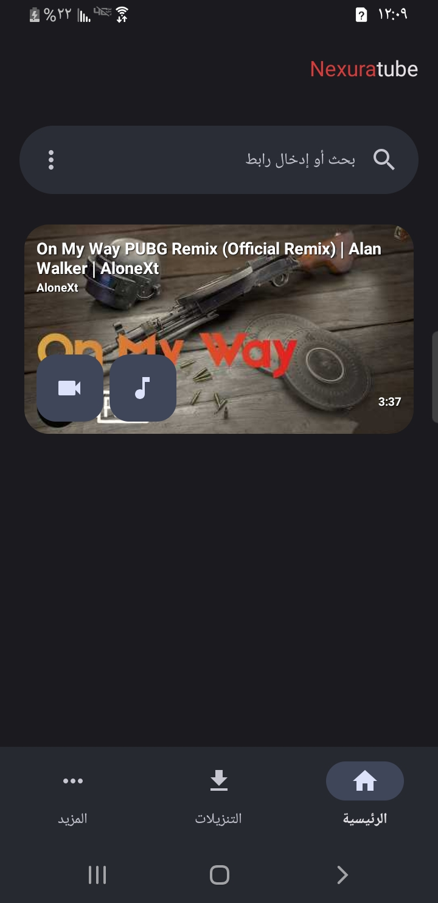
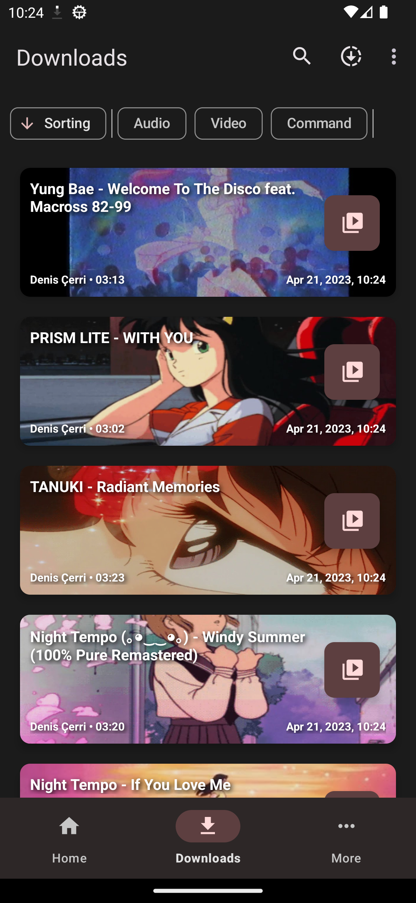
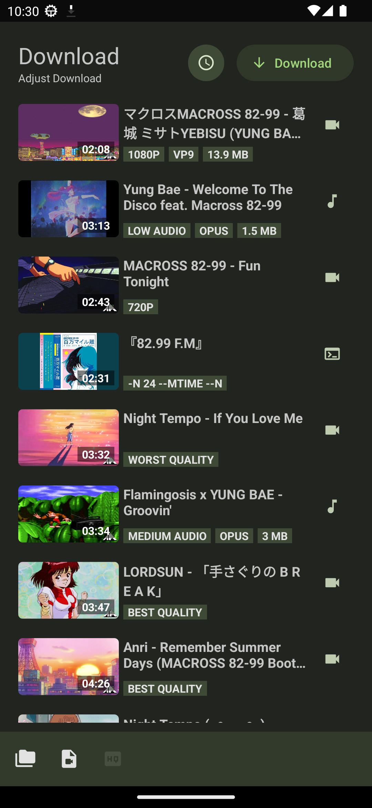
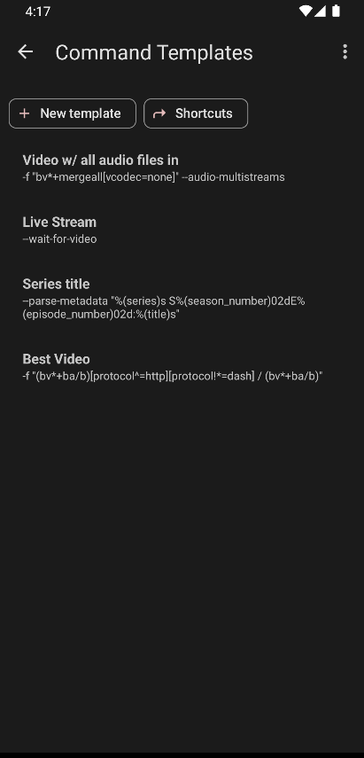
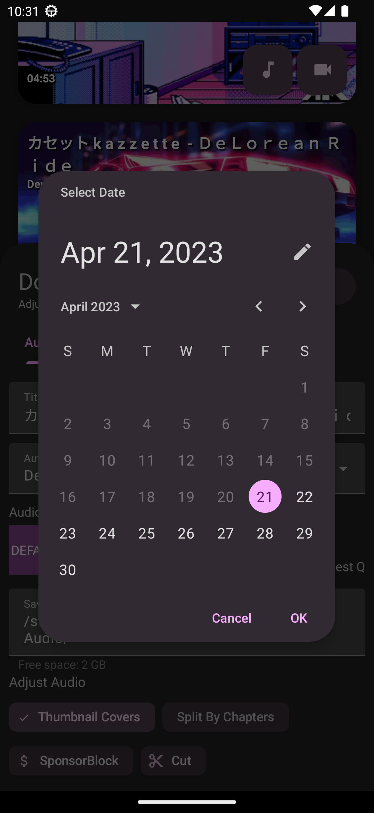
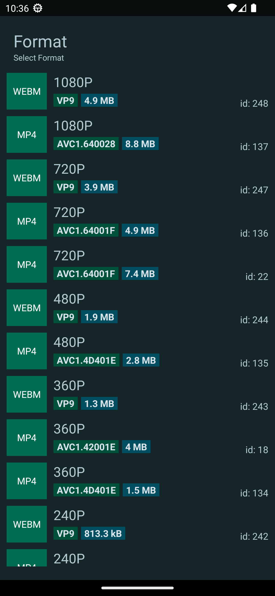
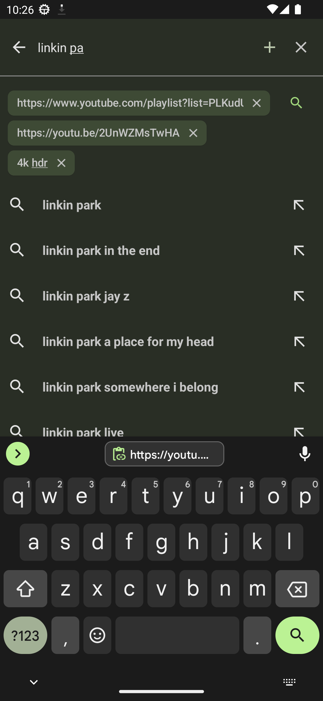
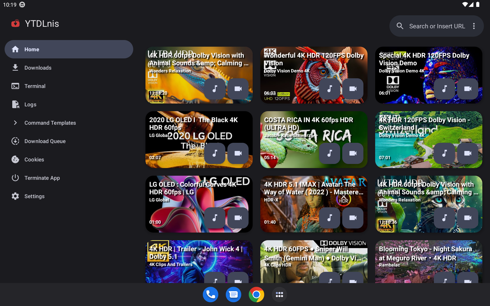

<h1 align="center">
	  
	NexuraTube
</h1>

	English
	&nbsp;&nbsp;| &nbsp;&nbsp;
	<a href="README-ar.md">العربية</a>

<h3 align="center">
	NexuraTube is a free and open source video/audio downloader using yt-dlp for Android 7.0 and above.
</h3>
<h4 align="center">
	Designed and Developed by Mashal Mazen Al-Hodali
</h4>

### The links above are the only official sources of NexuraTube.

## 💡 Features:

- Download audio/video files from hundreds of websites.
- Support for playlists and full channel downloads.
- Queue and schedule downloads by date and time.
- Built-in SponsorBlock support to skip unimportant parts.
- Embed subtitles and metadata automatically.
- Modern Material You interface with Dark Mode support.
- Cookie support for downloading private content from Instagram and other platforms.

## 📲 Screenshots

  
  
  
   
  
  
  
   
  
  
  
   
  
  
  
   
  

## 🔑 Package Name

The app's package name is `com.nexuratube.svg`.

## 📄 License

This project is licensed under the **GNU GPL v3.0** license.

## 🙏 Credits

This application relies on the power of open-source tools:
- [yt-dlp](https://github.com/yt-dlp/yt-dlp)
- [youtubedl-android](https://github.com/yausername/youtubedl-android)
- and the contributors of the open-source projects that made this work possible.
